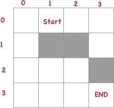
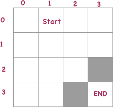

# Zadatak 3

[google doc link](https://drive.google.com/drive/mobile/folders/1G-AjDUzgRHLCOfUn5rVhHCENW-7PSIBF?usp=sharing)

Autor: Zoran Lazic

Potrebno je napraviti program koji ce naci put kroz matricu velicine 10*10.<br>
Matrice [https://en.wikipedia.org/wiki/Matrix_(mathematics)](https://en.wikipedia.org/wiki/Matrix_(mathematics))

Ukratko, matricama mozemo predstaviti neku tablu sa kordinama. Zamislite sahovsku tablu. Ona je matrica 8*8. Svako polje ima x kordinatu i ima y kordinatu preko koje dolazimo do tog podatka.

Ono sto je potrebno da uradite u ovom zadatku je sledece.

Napravite config.js fajl koji u sebi da sadrzi sledece informacije
+ startCoordinate - niz u obliku [x, y]
+ endCoordinate - niz u obliku [x, y]
+ blocks - int (20 blokova treba da postoji)

startCoordinate<br>
Pocetna tacka iz koje krece vas algoritam.

endCoordinabr>
Krajnja tacka u kojoj se zavrsava vas algoritam

blocks<br>
Broj random tacaka kroz koje ne moze da se prodje.

Potrebno je napraviti algoritam koji ce vratiti niz sa koordinatama kojima je potrebno ici da bi se najbrze stiglo od startCoordinate do endCoordinate bez prolazenja kroz block polja.

Takodje, potrebno je napraviti algoritam koji ce da generise block polja tako da su ona random, ali da nikako ne zatvori startCoodinate polje i endCoordinate polje.

Kretanje vrstite po sledecem pravilu. Dozvoljene akcije su<br>
[x + 1, y]<br>
[x - 1, y]<br>
[x, y + 1]<br>
[x, y - 1]<br>
To  znaci da mozete za jednu kockicu da se pomerite, levo, desno, gore ili dole.

Primer ispravno generisane matrice i rezultat




Ovo je matrica 4 * 4.<br>
Siva polja predstavljaju blokove kroz koje se ne moze kretati<br>
Rezultat kretanja ovde bi bio sledeci<br>
[[0, 0], [0, 1], [0, 2], [1, 2], [2, 2], [3, 2], [3, 3]]

Primer matrice sa nepravilno generisanim blokovima




**Napomena**<br>
Ne postoji nikakav vizuelni prikaz zadatka i ovo se isljucivo radi u Node.js-u.

Kod se treba pokrenuti uz pomoc komande
```sh
node index.js
```


[../README.md](../README.md)
